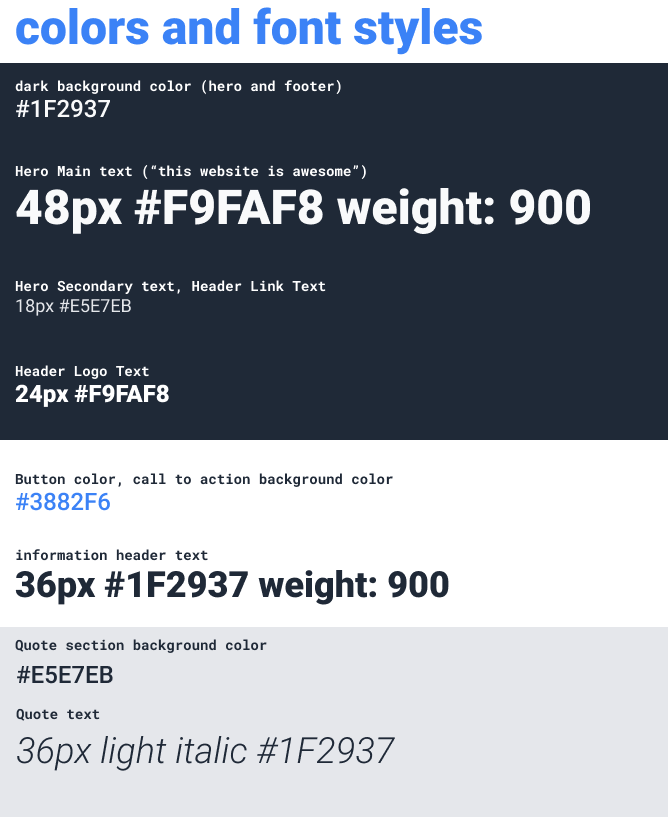
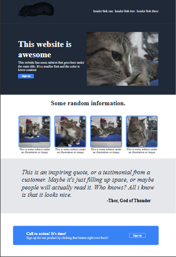

# 📱 Flexbox Landing Page — The Odin Project

Landing page desarrollada como parte del currículo de **The Odin Project**. El objetivo principal de este proyecto fue dominar el posicionamiento, la distribución y la estructuración de elementos utilizando **CSS Flexbox** a partir de un diseño visual de referencia.

> **[👉 Ver proyecto en vivo (GitHub Pages)](https://matias-vallejos.github.io/FlexboxLandingPage/)**

---

## 🚀 Tecnologías Utilizadas
* **HTML5** (Estructura semántica)
* **CSS3** (Estilos personalizados)
* **CSS Flexbox** (Para la alineación y distribución flexible de componentes en la interfaz)

---

## 📋 Características del Proyecto
* **Maquetación con Flexbox:** Uso de contenedores flexibles (`display: flex`) y ajuste de elementos en filas y columnas de manera limpia.
* **Distribución Fluida:** Reparto del espacio mediante `justify-content`, `align-items`, `gap` y `flex: 1`, con `flex-wrap` para que los elementos se reacomoden según el ancho disponible y `max-width` para controlar la longitud de las líneas de texto.
* **Estructura Modular:** Separación clara entre la estructura HTML y las reglas de diseño CSS.

---

## 📌 Acerca del Diseño
Este proyecto fue desarrollado maquetando un diseño visual estático provisto por The Odin Project, poniendo a prueba la capacidad de traducir una maqueta estricta en código web real y funcional.
Imagenes de referencia del objetivo a lograr

## 🖼️ Vista Previa (Resultado Final)

---

## 💻 Ejecución del Proyecto
1. Clonar el repositorio o descargarlo en tu computadora.
2. Abrir el archivo `index.html` en cualquier navegador web moderno para visualizar la página funcionando.

---

> 🎓 **Proyecto de práctica:** Desarrollado de manera autodidacta siguiendo los estándares de maquetación web de The Odin Project.

